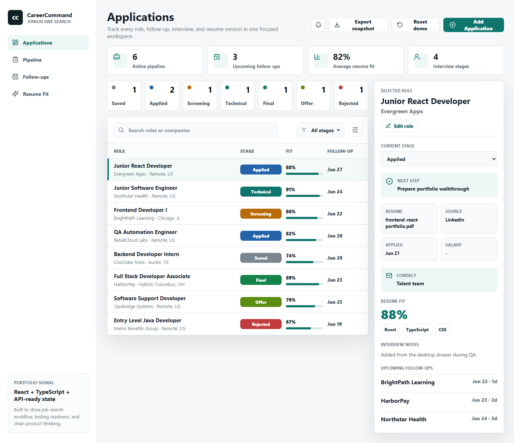

# CareerCommand


CareerCommand is a desktop job application tracker for junior software engineers who want a practical way to manage applications, follow-ups, interview stages, resume versions, and role fit.



The project is intentionally portfolio-oriented: it demonstrates a modern React + TypeScript frontend, structured application state, desktop dashboard layout, accessible controls, and a clear path toward a production backend.

## Live Demo

GitHub Pages deployment target:

https://justinspratt07.github.io/career-command/

## What It Demonstrates

- React component composition for a real desktop product surface
- TypeScript domain modeling for job applications and pipeline stages
- State-driven UI with search, filtering, add/edit flows, and selected-detail panels
- localStorage persistence for a working client-side app
- Unit-tested business logic with Vitest
- Desktop end-to-end workflow coverage with Playwright
- GitHub Actions CI for linting, type checking, tests, and production builds

## Tech Stack

- React 19
- TypeScript
- Vite
- Vitest
- Playwright
- lucide-react icons
- GitHub Actions
- Backend-ready data model for PostgreSQL/API persistence

## Features

- Track applications by role, company, source, location, salary, and contact
- Add new applications through a desktop drawer workflow
- Edit the selected application without leaving the dashboard
- Save application data in localStorage between sessions
- Filter by pipeline stage
- Search across roles, companies, locations, sources, and skills
- Select an application and update its current stage
- Export the current application list as JSON
- Reset the dashboard back to demo data for portfolio walkthroughs
- View next steps, resume version, source, applied date, salary, contact, skill tags, and notes
- See active pipeline, follow-up, resume fit, and interview metrics
- Desktop-only dashboard optimized for laptop and monitor demos

## Run Locally

```bash
pnpm install
pnpm dev
```

Then open the local Vite URL shown in the terminal.

## Quality Checks

```bash
pnpm lint
pnpm typecheck
pnpm test:unit
pnpm build
pnpm test:e2e
```

The CI workflow runs linting, type checking, unit tests, production build, and the desktop Playwright flow.

## Project Structure

```
src/
  App.tsx                  # Desktop dashboard UI and interaction wiring
  applicationLogic.ts      # Testable filtering, metrics, stage, and form helpers
  applicationLogic.test.ts # Vitest unit coverage
  data.ts                  # Seeded portfolio demo data
tests/e2e/
  application-flow.spec.ts # Playwright add/edit/persist desktop flow
docs/
  architecture.md
  careercommand-desktop.png
.github/workflows/
  ci.yml
```

## Architecture Notes

The current version is intentionally client-side so the app is easy to run, test, and review. Application records are persisted in `localStorage`, while the data model is already shaped for a future API/database layer.

Recommended production path:

- Add real authentication
- Persist applications with PostgreSQL
- Add an Express, FastAPI, or Node API
- Import/export CSV
- Add email reminder integration
- Use an AI resume-fit endpoint with privacy-safe local controls
